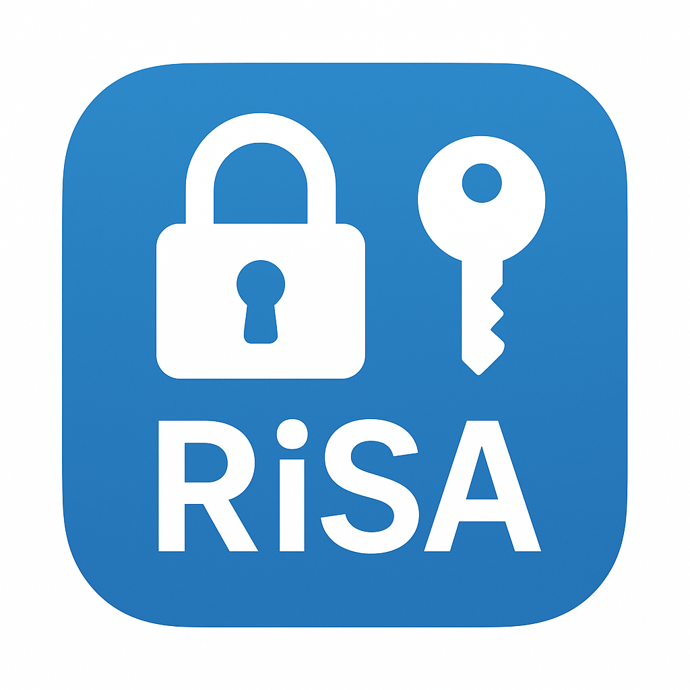

# 🔐 RiSA - RSA 암호화 데스크톱 앱

  

  **민감한 데이터를 로컬에서 안전하게 암호화하는 오픈소스 데스크톱 앱**

  
  
  
  

---

## 🛡️ 왜 RiSA인가?

**완전한 로컬 보안**: 모든 암호화 과정이 사용자의 컴퓨터에서만 실행됩니다. 네트워크 전송 없이, 서버 업로드 없이, 온전히 로컬에서 처리됩니다.

**투명성과 신뢰**: 모든 소스코드가 공개되어 있어 언제든 검증할 수 있습니다. 숨겨진 백도어나 데이터 수집이 없습니다.

**편리한 GUI**: 복잡한 명령어나 설정 없이 직관적인 그래픽 인터페이스로 강력한 RSA 암호화를 사용할 수 있습니다.

---

## 📥 다운로드

### 🌐 공식 다운로드 페이지

**[https://0-rok.github.io/RiSA](https://0-rok.github.io/RiSA)**

가장 쉽고 안전한 다운로드 방법입니다. 운영체제를 자동으로 감지하여 최적의 설치 파일을 제공합니다.

*최신 릴리즈는 [GitHub Releases](https://github.com/0-ROK/RiSA/releases/latest)에서도 확인할 수 있습니다.*

---

## ✨ 주요 기능

### 🔒 **강력한 RSA 암호화**
- RSA-OAEP (권장) 및 RSA-PKCS1 알고리즘 지원
- 1024, 2048, 4096 비트 키 크기 선택 가능
- 안전한 키 생성, 관리, 가져오기/내보내기

### 🔗 **Chain Builder (연속 작업)**
- 여러 작업을 순차적으로 연결하여 실행
- URL 인코딩/디코딩, Base64 인코딩/디코딩
- RSA 암호화/복호화를 포함한 복합 워크플로우

### 🌐 **HTTP Parser (URL 템플릿)**
- URL 템플릿을 활용한 파싱 및 생성
- 경로 파라미터와 쿼리 파라미터 추출
- 재사용 가능한 템플릿 시스템

### 🎨 **직관적인 사용자 경험**
- 깔끔한 사이드바 네비게이션
- 실시간 검증 및 피드백
- 작업 히스토리 자동 저장

---

## 🚀 빠른 시작

### 1️⃣ 설치

1. [공식 다운로드 페이지](https://0-rok.github.io/RiSA)에서 운영체제에 맞는 버전을 다운로드
2. DMG 마운트 (macOS)

### 2️⃣ 키 생성

1. 앱 실행 후 **키 관리** 탭으로 이동
2. **새 키 생성** 버튼 클릭
3. 키 크기 선택 (권장: 2048비트 이상)
4. 키 이름 입력 후 생성

### 3️⃣ 암호화/복호화

1. **메인** 탭에서 작업 선택 (암호화/복호화)
2. 텍스트 입력 및 키 선택
3. 알고리즘 선택 (권장: RSA-OAEP)
4. **실행** 버튼 클릭

---

## 🛡️ 보안 정보

### 지원 알고리즘

- **RSA-OAEP** ⭐ (권장): 최신 보안 표준, OAEP 패딩 사용
- **RSA-PKCS1**: 호환성을 위한 기존 표준 (보안 위험 있음)

### 권장 사항

- **키 크기**: 2048비트 이상 사용 (4096비트 권장)
- **알고리즘**: RSA-OAEP 사용
- **키 관리**: 개인키는 안전한 곳에 보관

### 신뢰할 수 있는 다운로드

- ✅ **오픈소스**: 모든 코드는 GitHub에서 공개적으로 검증 가능
- ✅ **자동 빌드**: GitHub Actions로 자동 빌드되어 변조 불가능
- ✅ **MIT 라이선스**: 자유롭게 사용, 수정, 배포 가능

---

## 🔄 자동 업데이트

RiSA는 자동 업데이트를 지원합니다:

- 새 버전 출시 시 앱 내 알림
- 백그라운드 다운로드
- 원클릭 설치 및 재시작

---

## 📄 라이선스

이 프로젝트는 [MIT 라이선스](LICENSE) 하에 배포됩니다.

---

## 💬 지원

문제가 있거나 기능 제안이 있으시면 [GitHub Issues](https://github.com/0-ROK/RiSA/issues)에서 알려주세요.

---

  
<strong>RiSA와 함께 안전한 암호화를 경험하세요! 🔐</strong>

  
  [다운로드](https://0-rok.github.io/RiSA) • [릴리즈 노트](https://github.com/0-ROK/RiSA/releases) • [문제 신고](https://github.com/0-ROK/RiSA/issues)

