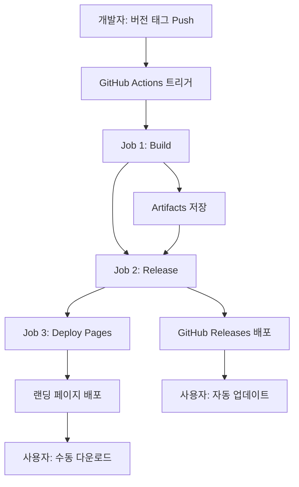

# 🔄 RiSA 업데이트 아키텍처

## 📋 개요

RiSA는 **2단계 빌드/배포 아키텍처**를 사용하여 안정적이고 유연한 자동 업데이트 시스템을 구현했습니다.

## 🏗️ 전체 구조



## 🎯 2단계 빌드/배포 아키텍처

### **기존 방식 (1단계)**

```bash
electron-builder --publish always
```

- ❌ 빌드와 배포가 강하게 결합
- ❌ 배포 실패 시 전체 실패
- ❌ 제한적인 배포 옵션
- ❌ 복잡한 에러 처리

### **새로운 방식 (2단계)** ✅

```bash
# 1단계: 빌드만
electron-builder --publish never

# 2단계: 배포만
softprops/action-gh-release@v1
```

- ✅ **관심사 분리**: 빌드와 배포 독립적
- ✅ **안정성**: 단계별 독립적 처리
- ✅ **유연성**: 다양한 배포 옵션
- ✅ **확장성**: 추가 배포 채널 쉽게 추가

## 📁 파일별 역할

### `package.json`

```json
{
  "scripts": {
    "package:gh-action": "electron-builder --mac --publish never",
    "package:local": "electron-builder --mac --publish never"
  }
}
```

- **`package:gh-action`**: GitHub Actions 전용 (빌드만)
- **`package:local`**: 로컬 개발용 (빌드만, GH_TOKEN 불필요)

### `.github/workflows/release.yml`

```yaml
jobs:
  build: # Job 1: 빌드만
  release: # Job 2: 배포만
  deploy-pages: # Job 3: 랜딩 페이지
```

### `src/main/main.ts`

```typescript
// GitHub Releases와 연동하여 업데이트 확인
autoUpdater.setFeedURL({
  provider: "github",
  owner: "0-ROK",
  repo: "RiSA",
});
```

### `src/renderer/components/UpdateNotification.tsx`

- **자동 다운로드**: electron-updater 사용
- **수동 다운로드**: 랜딩 페이지로 이동 (Fallback)

### `scripts/generate-page.sh`

```bash
# GitHub API에서 실제 다운로드 링크 가져오기
ASSETS=$(curl -s "github.com/api/repos/.../releases/tags/$TAG")
```

## 🔄 업데이트 플로우

### 1. **자동 업데이트 (Primary)**

```
사용자 앱 → electron-updater → GitHub API → 업데이트 감지 → 다운로드 → 설치
```

### 2. **수동 다운로드 (Fallback)**

```
사용자 앱 → 에러 발생 → 랜딩 페이지 → GitHub API → 실제 다운로드 링크 → 수동 설치
```

## 🎯 핵심 장점

### **파일명 불일치 해결**

- **문제**: 릴리즈 태그 `v0.1.16` vs 파일명 `RiSA-0.1.8-mac-arm64.dmg`
- **해결**: GitHub API의 `browser_download_url` 사용
- **결과**: 파일명과 무관하게 실제 존재하는 파일 다운로드

### **다중 배포 채널**

1. **자동 업데이트**: electron-updater
2. **수동 다운로드**: GitHub Pages
3. **직접 다운로드**: GitHub Releases
4. **향후 확장**: App Store, Microsoft Store 등

### **개발 경험 개선**

- **로컬 테스트**: `pnpm run package:local` (토큰 불필요)
- **자동 배포**: Git 태그만 푸시하면 모든 과정 자동화
- **에러 처리**: 단계별 독립적 처리

## 🚀 사용법

### **개발자 워크플로우**

```bash
# 1. 버전 업데이트
vim package.json  # version: "0.1.16"

# 2. 로컬 테스트
pnpm run package:local

# 3. 배포
git tag v0.1.16
git push origin v0.1.16

# 4. 자동 실행: GitHub Actions → 빌드 → 배포 → 페이지
```

### **사용자 경험**

1. **앱 실행** → 자동 업데이트 확인 (3초 후)
2. **업데이트 감지** → 알림 모달 표시
3. **선택 옵션**:
   - **자동 다운로드**: 백그라운드 다운로드 → 재시작 안내
   - **수동 다운로드**: 랜딩 페이지 → 파일 선택 → 수동 설치
   - **나중에**: 모달 닫기

## 📊 성능 및 안정성

### **빌드 시간**

- **병렬 처리**: 빌드와 배포 단계 분리로 효율성 증가
- **캐싱**: pnpm 캐시 및 GitHub Actions 캐시 활용

### **에러 복구**

- **빌드 실패**: 배포에 영향 없음
- **배포 실패**: 빌드 재실행 불필요
- **자동 업데이트 실패**: 수동 다운로드로 Fallback

### **확장성**

- **새 플랫폼**: Windows/Linux 빌드 쉽게 추가
- **새 배포 채널**: App Store 등 추가 배포 옵션
- **커스텀 로직**: 각 단계별 독립적 확장

## 🎉 결론

이 **2단계 빌드/배포 아키텍처**는 electron 앱의 업데이트 시스템을 **안정적이고 유연하며 확장가능**하게 만들어줍니다.

개발자는 편리하게 배포할 수 있고, 사용자는 안정적으로 업데이트를 받을 수 있는 **Win-Win 구조**입니다! 🚀
